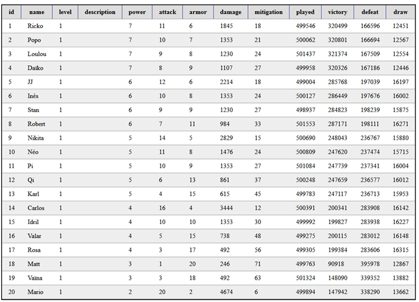
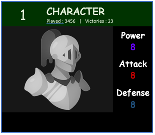

# Gamecards

L'objectif est de récupérer des données via AJAX et de les afficher sur une page web HTML.

Fichier JSON à récupérer via AJAX : https://arfp.eu/dataset/cards.json

Afficher les données reçues dans un tableau HTML. 

Appliquez les règles CSS nécessaires afin que le tableau ressemble à la capture suivante : 

A la suite de ce tableau, afficher les cartes suivantes :
-	La carte possédant le plus de puissance d’attaque
-	La carte possédant le plus d’armure
-	La carte ayant le plus de parties jouées
-	La carte ayant le plus grand nombre de victoires

Cet affichage ressemblera au maximum à la capture visible ci-dessous (le choix des couleurs vous appartient). 

Utilisez l’icône ci-dessous :

